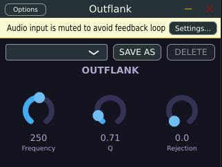

# Outflank — *The Spatial Tactician*



You've been running this raid comp forever: bass is your **tank**, and a tank that
wanders off the taunt line is a wipe. Outflank is the crowd-control cooldown that
keeps your low end locked on-target — dead center, immovable, holding aggro — while
your mids and highs go full DPS-rogue and flank wide into the stereo field for
max damage output. No positional threat lost, no group-wide cancellation, just a
clean pull every time.

## The build

**Frequency** — your crossover pull-range slider (40 Hz – 2 kHz, log taper). Below
this line the tank stays taunted: Left and Right are summed and forced to a mono
Mid signal, so your kick and bass never break formation or drift off-axis.
Above it, the raid spreads out.

**Q** — how sharp the aggro table splits at the pull. A tight Q keeps the handoff
between "tank zone" and "DPS zone" surgical, so you're not accidentally CC-ing
sub-bass energy that should've stayed wide, or leaking flanking energy back into
the mono anchor.

**Rejection** — the party-buff slider (0–100%). At 0%, Mid content above the
crossover point is simply discarded once panned — classic loot, no bonus roll.
Crank it up and that same Mid energy gets rerouted into the Side channel through
a matched quadrature all-pass pair instead of being vaporized, so widening the
top end doesn't cost you a single HP of level. (An earlier build tried a single
all-pass shortcut for this and it wiped the raid with midrange cancellation —
current build uses the matched pair specifically to dodge that mechanic.)

**Presets** — save/recall your loadouts (`SAVE AS` / `DELETE`), with a factory
starter kit: `Tight Mono Bass` (max threat control, low end nailed to the floor),
`Wide Airy` (full flank, maximum battlefield width), and `Subtle` (a light buff,
barely-there widening for mixes that don't need a full aggro reset).

## Why it matters (sound-engineer read)

Outflank is a Mid/Side crossover: everything below the crossover frequency has
its Side component discarded, collapsing low-end phase and level issues that
plague wide masters and mono-compatible playback (club systems, phone speakers,
vinyl cutting). Everything above it is free to be widened via inter-channel
decorrelation without touching bass mono-compatibility. The `Rejection` control
governs a quadrature all-pass pair (not a naive single all-pass — that produced
audible destructive interference in the midrange) that redirects rather than
discards Mid energy when widening, so gain isn't sacrificed for width.

## Status

Implemented — migrated to [DPF](https://github.com/DISTRHO/DPF), building
VST3/CLAP/LV2 (+AU on macOS). No Standalone target: Outflank is an effect,
and this workspace only requires Standalone for instruments. See `Source/`
for the processor/editor and `Source/DSP/` for the crossover, filter, and
quadrature all-pass DSP; `Tests/` holds the framework-free unit tests (CTest).

```bash
cmake -B build -G Ninja -DCMAKE_BUILD_TYPE=Debug -DCMAKE_EXPORT_COMPILE_COMMANDS=ON
cmake --build build --parallel
# Outputs: build/bin/Outflank.vst3, build/bin/Outflank.clap, build/bin/Outflank.lv2
```
